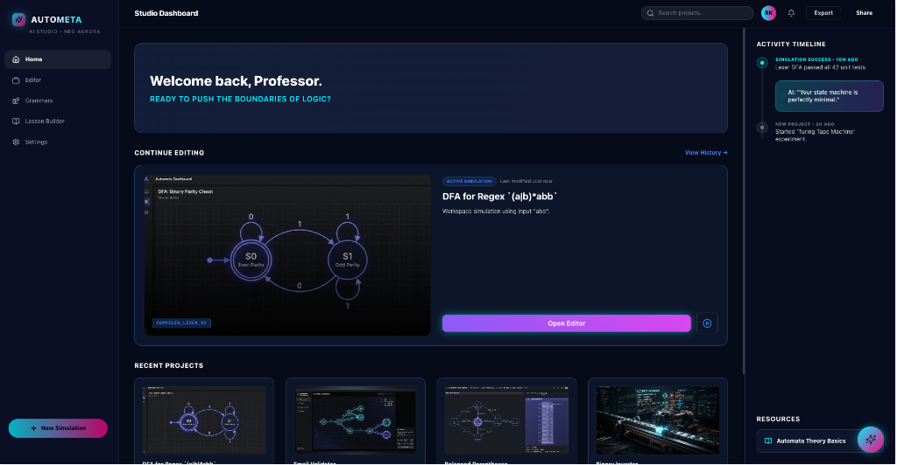

# AUTOMETA — AI Studio for Automata & Language Theory

AUTOMETA is a premium, dark-themed educational workspace and IDE designed for studying, simulating, and teaching Automata Theory, Formal Languages, and Compilers. It combines dynamic graphic simulation editors, rule-based transformation walkthroughs, and LLM-guided tutors into a cohesive, self-contained desktop and web application.

---

## 🎨 Demo / UI Preview

Below is the layout of the **AUTOMETA Studio Dashboard**, showcasing the project management canvas, the learning resources, and the AI Tutor timeline panel:



---

## 🚀 Key Features

### 1. Interactive Automata Studio (Editor)
*   **Multi-Model Support**: Design and build Deterministic Finite Automata (**DFA**), Non-Deterministic Finite Automata (**NFA**), **Mealy** machines, **Moore** machines, Pushdown Automata (**PDA**), and **Turing Machines**.
*   **Live Simulation Timeline**: Visual playback controller to run test strings step-by-step with play/pause animations.
*   **Visual Stack & Tape Displays**: Watch tape heads read/write in real-time or PDA stacks push/pop.
*   **Keyboard Shortcuts**: Command/Ctrl + Backspace to delete selected elements, spacebar to play/pause simulations, and left/right arrows to step through timelines.

### 2. Deterministic Transformation Sidebars
*   **NFA-to-DFA Walkthrough**: Interactive panel displaying the subset construction row-by-row. Stepping through highlights the active NFA state subsets on the React Flow canvas before loading the final DFA.
*   **DFA Minimizer**: Interactive Myhill-Nerode grid detailing distinguishing pairs and equivalence merges.

### 3. CFG Compiler & Parser Suite (Grammars)
*   **Leftmost Derivation Trace**: Shortest derivation paths computed dynamically via rule-engine BFS search.
*   **Grammar Simplification**: Step-by-step ε-elimination, unit production elimination, and useless symbol pruning showing Chomsky Normal Form (CNF) and Greibach Normal Form (GNF) side-by-side.
*   **Parse Table Generator**: Renders LL(1) and SLR(1) parsing tables dynamically, flagging shift/reduce or reduce/reduce conflicts.
*   **Stack Walkthrough**: Live simulator tracing parser stack actions step-by-step on custom input strings.

### 4. AI Tutor & Automated Grading
*   **Canvas Grading**: Submits the designed automaton structure to the backend, simulates test inputs up to length 3, and feeds the results to the selected LLM to return a detailed feedback report.
*   **LLM Providers**: Easily toggle between local **Ollama** or external APIs (**Gemini**, **OpenAI**, **Groq**) inside Settings.
*   **Lesson & Worksheet Builder**: Generates educational slides and quiz questions, with direct export support for worksheets as Markdown (`.md`) files.

### 5. Native Desktop Application
*   **Tauri v2 Shell**: Wrapped in a lightweight Tauri desktop container.
*   **Python Sidecar**: Bundle the FastAPI Python server as a standalone, pre-compiled binary sidecar that auto-spawns on startup.

---

## 🛠️ Tech Stack

*   **Frontend**: React 19, TypeScript, Vite, TailwindCSS, `@xyflow/react` (React Flow)
*   **Desktop Wrapper**: Tauri v2, Rust, `tauri-plugin-shell`
*   **Backend Services**: FastAPI, Python 3.9, SQLModel (SQLite), PyInstaller
*   **Engines (Monorepo Packages)**:
    *   `packages/rule-engine`: SLR(1)/LL(1) tables, Chomsky/Greibach conversions, BFS derivations, minimizations.
    *   `packages/simulation-engine`: Automata simulators (NFA, DFA, PDA, TM, Mealy, Moore).
    *   `packages/timeline-engine` & `packages/animation-engine`: Timeline controller state and React Flow animations.

---

## 💻 Quick Start & Setup

### Prerequisites
*   [Bun](https://bun.sh) (v1.3+) or Node.js (v20+)
*   [Rust & Cargo](https://www.rust-lang.org/tools/install) (for Tauri compilation)
*   [Python 3.9+](https://www.python.org/downloads/)

### Local Development Setup
1. **Clone the repository**:
   ```bash
   git clone https://github.com/himanshuraiml/autometa.git
   cd autometa
   ```

2. **Install frontend/desktop dependencies**:
   ```bash
   bun install
   ```

3. **Install python backend dependencies**:
   ```bash
   cd services/backend
   python -m venv venv
   source venv/bin/activate  # On Windows: .\venv\Scripts\activate
   pip install -r requirements.txt
   cd ../..
   ```

4. **Launch development environment**:
   *   **Web Only**: `bun --cwd apps/web dev` (Runs React frontend at http://localhost:5173)
   *   **Desktop App**: `bun desktop` (Compiles Rust shell and launches the Tauri window wrapping the frontend)
   *   **Python API**: `cd services/backend && ./venv/bin/fastapi dev main.py` (Runs API server at http://localhost:8000)

---

## 🤝 Contributing

We welcome contributions from educators, students, and compiler engineers! To contribute:

1. **Fork** the repository and create your feature branch:
   ```bash
   git checkout -b feature/amazing-feature
   ```
2. **Format and run test suites** to verify changes:
   ```bash
   npm run test
   ```
3. **Commit** your changes with meaningful commit messages.
4. **Push** to the branch and open a **Pull Request**.

## 🍏 macOS Gatekeeper ("App is damaged") Bypass
Since this release is compiled on GitHub Actions without a $99/year Apple Developer certificate, macOS assigns a quarantine attribute to the downloaded app, displaying a deceptive warning: *"Autometa is damaged and can't be opened."*

To run the application, strip the quarantine flag by running the following command in your terminal:
```bash
xattr -cr /Applications/Autometa.app
```
*(If you are running the app directly from your Downloads folder, run `xattr -cr ~/Downloads/Autometa.app` instead).*

---

## 📄 License
This project is licensed under the MIT License.
